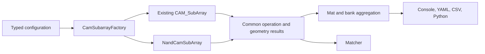

# NAND flash CAM investigation and implementation plan

Prepared against `updated` at `96e257a` on 2026-09-23. Scope: NAND-flash-based CAM/search arrays, as requested; conventional NAND storage is relevant only for programming, erase, geometry, and reusable historical equations.

**Recommendation:** implement an explicit NAND-string TCAM model, initially using two-state flash devices and exact/wildcard search. Reuse EvaCAM's configuration pipeline, exploration infrastructure, routing framework, and suitable peripherals. The old SLC NAND code is reference material for selected device/operation equations; it is not an existing NAND CAM implementation to reactivate.

**Implementation status:** the analytical NAND-string TCAM path and a separate first SLC-mode 3D linear RC transient backend are implemented. See [NAND TCAM](nand-tcam.md) and [3D NAND TCAM](nand-3d-tcam.md) for their distinct configuration, physical assumptions, APIs, and limitations. A polymorphic `NandCamBackend` selects the analytical or 3D model behind the existing subarray facade; `NandCamBank` supplies block scheduling and routing. The 3D backend adds explicit stack/layout geometry, finite precharge, carried electrical state, and numerical diagnostics. Numerical circuit verification is separate from physical device calibration: the examples remain synthetic, and no published device-level accuracy is claimed. A general interface covering every CAM subarray, nonlinear device/SPICE calibration, and the later extensions below remain roadmap items. The dated investigation and proposed stages below are retained as the original plan, not a statement that every stage is complete.

**1. Investigation scope and historical findings**

I searched all 162 commits reachable through the locally available Git refs, including `origin/beta-version`, `main`/`origin/main`, and `updated`/`origin/updated`. Searches covered flash identifiers, cell types, coupling and tunneling constants, configuration declarations, deleted files, and the relevant callers. No tags are present. Remote refs were not refreshed, so this describes the history available in this checkout. This was a source/history audit, not an execution or numerical validation of historical binaries.

| Version or change | What it contains | Implication |
| --- | --- | --- |
| `dc761af`, 2022-08-31, earliest source upload | Conventional SLC NAND branches in `SubArray.cpp`; flash parsing in `InputParameter`, `MemCell`, and `CAM_Cell`; NAND result labels | Useful historical equations and input vocabulary |
| `origin/beta-version` at `d36cb9d`, 2025-08-26 | Retains those branches; `Mat.h` embeds `CAM_SubArray subarray` | The NAND `SubArray` code does not establish a working NAND CAM path |
| `main`/`origin/main` at `9428b6e`, 2026-02-03 | README and `.gitignore` only | This branch is not the implementation baseline |
| `114c0c3`, 2026-02-10; `8fb36f1`, 2026-02-16 | Updated source tree and YAML transition retain flash fields and legacy subarray | Input support survived the refactor |
| `cae34b9`, 2026-06-18 | Removes obsolete `CAM_Cell` files | Duplicated legacy cell scaffolding removed |
| `f8b17e3`, 2026-06-18 | Deletes `include/model/SubArray.h` and the 839-line `src/model/SubArray.cpp` | Removes the conventional NAND implementation; the deleted file explicitly identifies itself as legacy with no current instantiation |
| `8b5b455`, 2026-06-26 | Starts removing cache code | Restoring old RAM/cache control flow would be a separate undertaking |
| `96e257a`, current | Flash fields, validation fragments, constants, and erase/program output names remain; `Mat` constructs `CAM_SubArray` | Current parsing and labels should not be interpreted as NAND CAM modeling support |

The searches found no configuration declaring `SLCNAND` or `MLCNAND` as its device type in the historical `.cell`, `.cfg`, or YAML files. Some generic sample files list these names in comments and demonstrate flash fields. No dedicated NAND CAM model or NAND CAM physical regression suite was found. Generic NAND logic gates, `CAM_RowNand`, `RowDecMergeNand`, and the June 18 row-decoder merge are unrelated to NAND flash storage.

**2. Inventory of NAND-related material and reuse decisions**

Historical paths below refer to the beta tree unless a revision/path is specified. Later reorganizations moved the same families through `src/`, `src/model/`, `src/technology/`, `src/config/`, `src/input/`, and `src/output/`.

| Component | Historical/current evidence | Proposed treatment |
| --- | --- | --- |
| Device identifiers | `typedef.h`; current `include/circuit/typedef.h`, `src/input/YamlNodeHelpers.cpp` | Preserve `SLCNAND`; keep `MLCNAND` rejected until a separate multilevel model exists |
| Device parameters | `MemCell.h/.cpp`, duplicated parsing in `CAM_Cell.cpp`; current `include/technology/MemCell.h`, `src/technology/MemCell.cpp` | Preserve program/erase/pass voltage, program/erase time, and gate-coupling vocabulary; move new NAND-specific behavior into typed specs |
| Array parameters | `InputParameter.h/.cpp`; current `InputConfig.h`, `ConfigSectionReaders.cpp` | Preserve `flash.page_size` and `flash.block_size`, explicitly defined as physical flash quantities |
| Units | Old page bytes converted to bits; block KB converted to bits; program microseconds and erase milliseconds converted to seconds | Keep current unit-aware YAML parsing; enforce overflow-safe geometry derivation |
| String geometry | Deleted `SubArray.cpp`: pages/block, two select devices, select/contact length overhead | Re-derive from explicit string geometry; reuse concepts, not hidden planar constants |
| Electrical model | Deleted `SubArray.cpp`: series resistance, floating-gate capacitance, bitline loading, precharge and sensing | Reference baseline for a labeled planar approximation only |
| Operations | Deleted `SubArray.cpp`: read, page program, block erase, tunneling and well charging | Port only independently checked terms into an operation model with explicit accounting units |
| External sensing | Historical `BankWithoutHtree.cpp` contains a NAND TODO | No completed external NAND sense path to restore; start with internal sensing |
| Unsupported modes | Historical `main.cpp`; current `EvaCamConfigValidator.cpp` | MLC was explicitly unfinished historically and remains blocked |
| Reporting | `Result.cpp`, `CAM_Result.cpp`; current `ResultConsole.cpp`, `ResultsYaml.cpp` | Retain familiar names but supply genuine NAND metrics and consistent program/erase granularity |
| Constants | Current `include/circuit/constant.h`: `TUNNEL_CURRENT_FLOW = 10 A/m²`, `DELTA_V_TH = 5 V` | Historical assumptions, not calibrated defaults for a new device |
| Schema and docs | `docs/input_samples/sample.architecture.yaml`, `sample.memory_device.yaml`, `schema.md`, `limitations.md`, `results-reference.md` | Clarify parser acceptance versus modeled capability; add a real canonical NAND example |
| Tests | `ConfigSectionReadersTest`, `CellAndMemoryLoaderBranchesTest`, `PhysicalDomainValidatorsTest`, `MemCellTest`, `ConfigValidatorsTest` | Existing coverage checks parsing, printing, and selected validation; add physical and integration tests |

The most useful recovery command is:

```sh
git show f8b17e3^:src/model/SubArray.cpp
```

In that revision, inspect lines 45–58 for SLC constraints, 154–175 for sensing/geometry, 296–305 for string RC, 578–615 for latency, and 730–800 for energy and unsupported MLC handling. The earliest implementation is available with `git show dc761af:SubArray.cpp`.

The historical model approximates string length as `blockSize / pageSize + 2`, string resistance as that length times a minimum-sized CMOS on-resistance, gate loading with a `GCR / (GCR + 1)` factor, and bitline precharge as `0.6 × Vdd`. It uses a sense swing of at least `0.2 × Vdd` and an explicit `max(HorowitzDelay, 20 × tau)` correction. These choices require independent calibration; none should silently become a modern NAND CAM default.

Other assumptions to revisit are the 5F select/contact overhead, the sense-amplifier mux minimum of two, fixed erase coupling `beta = 0.8`, negligible cell standby leakage, and the historical write-energy expression `(programEnergy + eraseEnergy / pagesPerBlock) / 2`. In particular, that final division by two is not an appropriate universal definition of energy per programmed page. Some comments also disagree with voltage expressions, such as the source-line programming term described as charging to Vdd but multiplied by program voltage squared.

**3. Current architectural gaps**

The following are concrete integration points, not just missing device parameters:

- `src/config/EvaCamConfigValidator.cpp` rejects MLC NAND but does not reject SLC NAND. Flash parameters can therefore pass this gate without selecting a NAND physical model.
- `src/input/PhysicalDomainValidators.cpp` treats program/erase times as optional flash fields and requires generic non-SRAM resistance and set/reset parameters. NAND needs its own required-field rules, including finite voltage values and conditional requirements for the selected electrical backend.
- `include/model/Mat.h` owns `unique_ptr<CAM_SubArray>` and `src/model/Mat.cpp` constructs that concrete type. The mat also enforces CAM geometry limits of at most 512 rows and columns. NAND string count and wordline count need explicit, topology-specific constraints.
- `CAM_SubArray::EffectiveMatchlineCellResistance()` implements parallel conductance: `1/R = k/Ron + (N-k)/Roff`. Its TCAM timing distinguishes an all-match high-resistance case from discharging mismatches. A NAND-string search needs a different network and match interpretation.
- `CAM_SubArray::Initialize()` swaps the logical row/column axes for the existing circuit representation. NAND geometry must not inherit this implicitly.
- Generic write timing uses `setPulse`/`resetPulse`. The current CAM calculations do not consume the dedicated flash program/erase voltage and time fields.
- `CAM_LevelShifter` uses generic CMOS calculations and a fixed write-energy multiplier. It is not a characterized NAND high-voltage driver or charge-pump model.
- Both bank implementations and `EvaCamResultExtractor` directly inspect CAM peripherals and reconstruct search mux/iteration costs. A new model cannot safely supply only a different subarray latency.
- `EvaCAM_Match` builds a TCAM lookup indexed only by mismatch count. Real NAND responses can depend on which device mismatches, the stored pattern, query biases, and internal string nodes. That lookup cannot be the general NAND electrical evaluator.
- YAML/console already relabel set/reset as program/erase for SLC NAND, while the run DTO exposes generic set/reset keys. All output surfaces need a common operation definition.

**4. Recommended first supported architecture**

Start with a two-state, two-device-per-symbol NAND-string TCAM, exact matching, stored don't-care symbols, and query masks. Keep `design.target: CAM`, `cam_type: TCAM`, and `type: SLCNAND`; add a separate explicit array topology selector. NAND flash technology and NAND-style logic connectivity are distinct concepts.

A useful public reference is the search primitive in [TCAM-SSD, Section 3.2](https://arxiv.org/html/2403.06938v1#S3.SS2): it stores each entry along a string, uses adjacent flash devices for each symbol, and controls individual wordline biases for parallel search. This provides an architectural reference; its SSD firmware and application performance are outside this implementation's scope.

For the proposed encoding, define threshold states `L` and `H` and characterized biases satisfying `VtL < Vread < VtH < Vpass`. The following truth table follows from those inequalities; the choice of 0/1 labels is a convention:

| Logical value | Stored threshold pair | Query voltage pair |
| --- | --- | --- |
| 0 | `(L, H)` | `(Vread, Vpass)` |
| 1 | `(H, L)` | `(Vpass, Vread)` |
| X / don't care | `(L, L)` | `(Vpass, Vpass)` |

Both transistors conduct for a matching pair; a mismatch leaves a blocking device. The full string conducts only when all compared pairs match. With a precharged-bitline implementation, a match produces the faster discharge. Model this polarity explicitly in the sensing contract.

Use one reserved validity pair or a modeled validity mask so an erased/unused string cannot appear as a matching all-X entry. Mask padded symbols and charge their actual pass-biased devices. Initially reject words that do not fit one string and reject threshold/best-match/MCAM requests for this topology. Add segmented words and approximate search after the exact model is validated.

Physical 3D NAND is a separate modeling choice from two-state storage. An SLC-mode search can use a 3D device characterization, but it must not inherit planar `F² × cell-count` area or generic CMOS transistor parameters as a 3D prediction.

**5. Proposed code organization**

Introduce a small CAM-subarray contract, with the existing `CAM_SubArray` and a new `NandCamSubArray` as implementations. Retain their distinct internal circuits. The contract should expose lifecycle calculations, geometry, operation totals/breakdowns, peripheral loads needed by the hierarchy, search evaluation, and supported capabilities. Do not expose existing CAM-specific pointers through the common contract.



| Proposed addition | Responsibility |
| --- | --- |
| `include/config/NandCamConfig.h` | Encoding, topology, string/block organization, operation and sensing settings |
| `include/technology/NandDeviceSpec.h` | Threshold states, bias-dependent device response, capacitance, program/erase characterization and provenance |
| `src/input/NandDeviceYamlLoader.cpp` | Strict parsing and validation of NAND device data |
| `src/model/NandCamGeometry.cpp` | Checked logical-to-physical mapping, allocation, padding, and peripheral counts |
| `src/model/NandStringModel.cpp` | Pattern-sensitive string current/voltage and sensing evaluation |
| `src/cam/NandCamSubArray.cpp` | Query drivers, NAND strings, sensing, page buffers, local search and operation accounting |
| `src/model/NandOperationModel.cpp` | Page program, block erase, and optional initialization/update cost models |
| `src/factories/CamSubarrayFactory.cpp` | Validated selection of the current or NAND model |
| `include/model/CamSubarrayModel.h` | Shared contract and typed result views; sufficient for existing and NAND CAM |

Names are proposed and should follow the surrounding naming convention during implementation. Each new public method/function needs focused tests under the repository guidelines.

**6. Implementation sequence and acceptance gates**

| Stage | Deliverable | Completion criterion |
| --- | --- | --- |
| A | Capability guard and baseline capture | SLC cannot silently run as a generic CAM; existing technologies retain their results |
| B | Configuration, encoding and geometry | Valid NAND inputs resolve deterministically; inconsistent geometry fails with a field-specific error |
| C | Standalone string model | Truth table, waveform behavior, position dependence and sensing window pass independent tests |
| D | Subarray and peripheral model | Local search area/timing/energy and program/erase units are internally consistent |
| E | Mat/bank, exploration and matcher integration | CLI and Python execute the same supported NAND model with correct capacity and search coverage |
| F | Characterized example and regression suite | Correlation evidence and limitations are published; current CAM regressions pass |
| Later | Segmentation, variation, multilevel and approximate search | Separate electrical validation for each added capability |

**Stage A — Establish honest capability boundaries.**

Capture representative SRAM, FeFET TCAM/MCAM, and resistive CAM outputs before refactoring. Correct `docs/limitations.md` to distinguish accepted syntax from working physical support. Add a precise runtime rejection for SLC NAND until the new topology is enabled. Keep MLC rejection. Test the guard through both normal runs and matcher construction, not only the explorer. Use one capability check shared by both paths.

Extract the common subarray result/aggregation boundary as a behavior-preserving change. Preserve existing result meanings and verify routing, mux, precharge, and iteration totals before adding NAND behavior. This should be a separate reviewable change from the NAND equations.

**Stage B — Define configuration and geometry.**

Extend the canonical split schemas rather than the legacy `.cfg` format. Proposed ownership:

| File | New information |
| --- | --- |
| `*.config.yaml` | Existing component references, objective, output controls |
| `*.cell.yaml` | `topology: nand_string`, complementary-pair encoding, topology-specific port/layout information |
| `*.memory_device.yaml` | Two threshold states, response-table reference or explicitly selected approximation, capacitances, operation characterization |
| `*.architecture.yaml` | Data wordlines/string, strings/block, blocks/subarray, reserved wordlines, active blocks, page-buffer/sense sharing |
| `*.sensing.yaml` | Bitline precharge, decision time/reference, required margin, sense mode and peripheral model |

The proposed keys are not currently accepted. Add typed fields, allowed-key validation, loaders, normalization, and schema documentation together. Dispatch port validation by topology so NAND strings do not need fictitious parallel-CAM ports to satisfy the current loader. Existing `flash.page_size` and `flash.block_size` retain their physical meaning; if explicit dimensions also appear, require agreement rather than silently choosing one source.

Separate these quantities in the resolved geometry: logical entry count, logical word width, physical NAND-cell count, physical data wordlines/string, select/dummy devices, strings/block, physical page size, erase-block size, validity overhead, and padding. Keep CMOS process node separate from NAND layer count, vertical pitch, string pitch and array footprint.

For the initial full-page SLC organization, with `L` data wordlines and `S` strings per block: a physical page has `S` bits and a block has `L × S` bits. This is a model restriction, not a universal equation for every NAND organization. With two cells per symbol, one validity pair and no other reserved wordlines, `Wmax = floor((L - 2) / 2)`. Select devices are additional devices, not data bits. For example, `L=128`, `S=256`, `W=63` gives 256 logical entries, 16,128 logical key bits, and 32,768 physical flash cells including validity. These are illustrative geometry values, not calibrated device parameters.

Validate nonzero dimensions, exact divisibility, integer overflow, entry capacity, mux divisibility and supported routing/sensing combinations. Revisit `ResolvedWordGeometry`, `DerivedValueHelpers`, `ExplorationSpaceResolver`, runtime sizing, candidate identity and `Mat`'s hard-coded size limits. Keep NAND geometry rules separate so existing CAM constraints stay meaningful. Do not equate logical padding with an unmodeled physical cell.

**Stage C — Implement and verify the string model.**

Implement encoding and bias generation independently from circuit evaluation. Test the nine stored/query combinations over `{0,1,X}`, validity handling, and padding. Preserve actual positions and states when evaluating a word.

Use a characterized device/string response as the supported numerical path. A simple series-resistance backend can be useful for unit tests and an explicitly labeled exploratory model:

```text
Rstring = Rselect_source + sum(Rcell[state, applied_bias, position])
          + Rselect_drain + Rinterconnect

Vbitline(t) ≈ Vprecharge × exp(-t / (Rstring × Cload))
```

This lumped expression is a starting approximation. Include distributed internal-node capacitances and position-dependent blocking behavior where required by characterization. Do not claim that generic CMOS `CalculateOnResistance()` predicts vertical flash conduction. Define response table dimensions, units, interpolation, supported bias/temperature ranges, and out-of-range rejection; record the model source and version.

Evaluate the slowest valid match and fastest invalid mismatch across the supported patterns. At a common decision time, require their bitline voltages to remain separated by the required sense margin, including the chosen reference/offset budget. Test every mismatch position, all-zero/all-one/mixed words, long strings, wildcard patterns and weak conduction. An invalid or reversed margin must not be hidden by taking an absolute value.

Expose logical match and electrical detectability separately. A correct ideal truth table does not establish a successful sensed result. Keep a topology-specific sensing polarity and a clearly defined decision time in both results and tests.

**Stage D — Build the physical subarray and operation costs.**

Model query latches/encoders, per-wordline voltage selection, suitable level shifters and drivers, select gates, source/bitline RC, precharge, page buffers/sense amplifiers and result latches. Reuse generic wires and digital blocks only within their characterized voltage/load range. Specify whether supply generation is internal; include charge-pump efficiency/area/startup or explicitly report externally supplied rail energy.

Build a timing schedule for query load, voltage setup, precharge, string evaluation, sensing, output and recovery. Account for safe overlap explicitly. A wordline setup or precharge phase shared across several sense groups must not be charged once per group by default.

Build an energy ledger for each operation: wordline and select-gate charging, bitline precharge/recharge, string conduction, level conversion/supply generation, sensing/latches and result handling. Define the supply-energy convention; for example a complete 0-to-V charging event draws `C × V²` from an ideal supply, while stored capacitor energy is `C × V² / 2`. Track voltage transitions and operation boundaries consistently. Include peripheral leakage even if cell standby leakage is approximated as zero.

For area, include the physical array, selects, contacts/staircase, voltage drivers, page buffers and control circuits. Use explicit planar or 3D geometry/characterization. With CMOS under the array, use a documented placement model for footprint and keep component areas separately; do not add overlapping physical regions as independent footprint.

Define `program_page` and `erase_block` metrics. For an initial implementation, measured total latency/energy is preferable when available; a pulse/verify model must state whether verify time is already included. Do not require users to duplicate NAND operations as generic set/reset pulses. Retain set/program and reset/erase aliases only at a documented compatibility boundary.

For an amortized write result, require the workload policy. A possible fully utilized-block policy is `Epage = Eprogram_page + Eerase_block / programmed_pages_per_erase`, without an unexplained factor of two. A transposed logical CAM entry spans multiple physical pages; report initialization/update costs using an explicit batch/update assumption. Avoid implying arbitrary in-place entry updates or adding an SSD controller/FTL simulator to this work.

**Stage E — Integrate hierarchy, exploration, matching, and outputs.**

Update `Mat`, `BankWithHtree`, `BankWithoutHtree`, `BankFactory`, and the matcher construction path to select the NAND model through the same capability/geometry rules. Represent each subarray's block organization explicitly. Mat/bank counts must not accidentally multiply physical blocks a second time.

Replace duplicated search-cost reconstruction in bank code and `EvaCamResultExtractor` with a shared operation schedule/result. Aggregate energy across blocks searched, latency across sequential versus parallel rounds, and output cost across result width. Distinguish the full set of entries covered by a query from the subset physically active in one round. Start with one supported routing mode and fixed organization; fail explicitly on others until their aggregation is tested, then add the second routing mode and DSE.

Use explicit search metrics for optimization, constraints and Pareto pruning. Define whether `Read*` means an actual page read; until implemented, reject those objectives for NAND rather than aliasing them silently to search. Define existing `Write*` objectives against a named operation/workload. Exclude unavailable metrics from ranking; zero or sentinel values must not win optimization.

Add NAND candidate dimensions only after fixed geometry works. Search useful bounded choices such as active-block count, sense sharing and characterized organization choices. Arbitrary interpolated string length/layer count is not automatically a valid technology. Include all NAND-specific choices in candidate identity and reconstructed results, and verify serial/parallel exploration produces the same candidates and optima.

For `EvaCAM_Match`, dispatch to pattern-aware NAND evaluation instead of `BuildMismatchLut()`. Preserve current behavior for other devices. Define query-mask support explicitly; the existing stored `-1` convention does not by itself establish query wildcard support. Reject mismatch-count-only electrical APIs for NAND unless they are explicitly documented as conservative bounds over positions/patterns. Reject approximate searches until implemented.

Update `EvaCamRunResultDto`, result extraction, console, YAML, exploration CSV, and `bindings/EvaCAM_Pybind.cpp` together. Report at least logical/physical capacity, encoding and model identity, array footprint, searched entries, search rounds, decision voltage/current, worst-case sense margin and pass/fail, search latency/energy, program-page cost, erase-block cost, and calibration status. Keep unsupported metrics unavailable with an explanation. Label single-sense or no-precharge results distinctly from complete-query results.

**Stage F — Ship a characterized example and validation evidence.**

Create `config/NAND_TCAM/` with a top-level `NAND_TCAM.config.yaml` and its referenced architecture, cell, memory-device and sensing files. Keep numerical test fixtures explicitly synthetic. A scientific example needs a cited device/process, operating point, extraction method and supported range; the generic sample flash voltages/times are not calibration data.

Correlate against SPICE/device measurements or published waveforms at multiple string lengths, bitline loads, wordline voltages, temperatures and mismatch positions. Check holdout points rather than fitting and validating on the same data. Choose and publish tolerances before calibration; report relative timing/energy error, absolute voltage-margin error, and classification failures separately. Historical NVSim-style numbers can be a cross-check for corresponding planar read/program/erase assumptions, not ground truth for NAND CAM search.

Calibration is the main external dependency: code can supply tested infrastructure and a clearly marked approximation without proprietary device data, but physically predictive support requires defensible characterization.

**7. Test and regression plan**

| Proposed test | Required coverage |
| --- | --- |
| `NandCamConfigTest.cpp` | Units, missing/unknown keys, voltage finiteness, physical/logical conflicts, backend-specific requirements, capability errors |
| `NandCamGeometryTest.cpp` | Encoding overhead, validity/padding, page/block units, overflow, non-power-of-two key widths, allocation boundaries |
| `NandCamEncodingTest.cpp` | Complete ternary truth table, query masks, unused-entry rejection, padded cells |
| `NandStringModelTest.cpp` | Analytic small networks, response interpolation, mismatch position, threshold crossing, sense polarity, infeasible sensing window |
| `NandCamSubArrayTest.cpp` | Lifecycle order, area ledger, RC loads, sharing, search schedule, energy conservation/accounting |
| `NandOperationModelTest.cpp` | Program versus erase granularity, verify inclusion, page batches, amortization, no double counting |
| `NandCamIntegrationTest.cpp` | CLI/model construction, mat/bank scaling, mux rounds, complete search coverage, logical capacity |
| Existing matcher/Python tests | Wildcards, ideal versus sensed result, unsupported operations, DTO parity and output units |
| Existing explorer tests | Invalid candidate rejection, candidate identity, deterministic threading, reconstruction, constraints and pruning |

Use independent circuit calculations and reference waveforms, not only golden numbers generated by the implementation. Targeted perturbations should show that string length, pass bias, selected-device response, sense load, and program/erase parameters influence the appropriate metrics. Read/program/erase parameter changes must not spuriously alter search when the circuits and supplies are independent.

Register each new assert-driven C++ test target in `Makefile`, write executables through `TEST_BIN_DIR`, and add the target to `.github/workflows/cpp-tests.yml`. Update the test inventory and package-data checks when adding public APIs or packaged configurations. Use `make clean` for generated test cleanup.

Run the new focused targets first. Relevant existing checks include `make test-yaml`, `make test-input-validation`, `make test-cam-subarray-topology`, `make test-cam-subarray-match`, `make test-mat-bank`, `make test-evacam-explorer`, `make test-results-serialization`, `make test-pybind-match`, and `make test-pybind-run`. Before a runtime/ownership PR, run `make test`; also run the existing unit/regression groups for the completed cross-cutting integration and a NAND-specific valgrind case, since the default valgrind fixture is not NAND.

Update `docs/schema.md`, `input-files.md`, `limitations.md`, `architecture.md`, `circuit-modeling.md`, `results-reference.md`, and `python-api.md` with the actual final behavior.

**8. Follow-on capabilities**

After the exact TCAM release, add long-key segmentation with modeled partial-match storage/combination and explicit parallel/sequential scheduling. Add threshold-voltage variation, layer/string correlation, temperature, retention and disturb only as supported by data, preserving deterministic sampling and reporting false-positive/false-negative behavior.

MLC/TLC storage and NAND MCAM need independent state/programming and search semantics. They cannot reuse the present two-FeFET squared-Euclidean response by changing an enum. For example, the authors of [Efficient and Reliable Vector Similarity Search Using Asymmetric Encoding with NAND-Flash](https://arxiv.org/html/2409.07832v1) identify string-current bottlenecks and encoding/search-iteration tradeoffs. Treat such approximate-search architectures as separately characterized models. ACAM/range search, ECC/retry hardware, wear management and full SSD scheduling are later projects rather than implicit parts of the initial feature.

The first release is complete when one documented NAND TCAM configuration runs through CLI and Python, its geometry and truth table are correct, search sensing is characterized over a stated range, area/energy/latency include the declared peripherals, operation units are explicit, unsupported modes fail clearly, and the existing CAM regressions pass.
